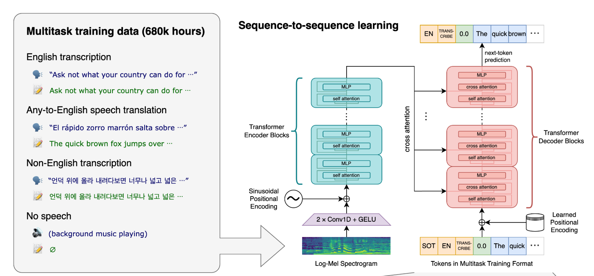
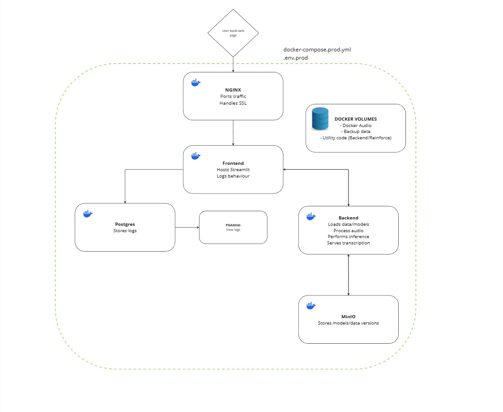
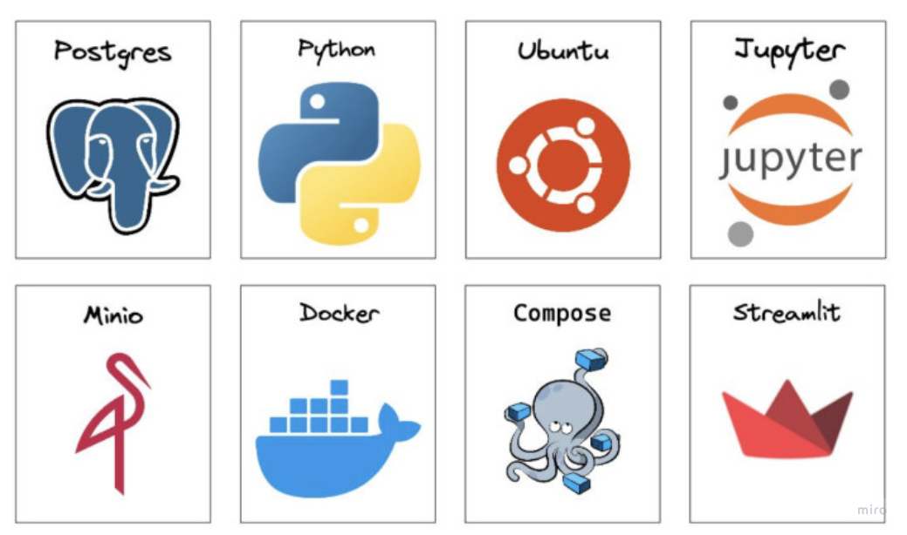

# AudioTransformer

[Frontend lives here](http://65.109.142.90:8501/)

AudioTransformer is an ongoing personal project based on [Whisper](https://github.com/openai/whisper), and fine-tuned on [common_voice_11](https://huggingface.co/datasets/mozilla-foundation/common_voice_11_0) for audio transcription tasks. The project is fully containerized and modularised. It is currently deployed on a remote Hetzner server costing me about £5/month. 

Illustrated below, the Whisper architecture uses an encoder-decoder structure which is optimised for sequential audio rather than text, as in the [original transformer](https://arxiv.org/abs/1706.03762). 

Preprocessing involves the creation of [mel-spectrograms](https://en.wikipedia.org/wiki/Mel-frequency_cepstrum), a visual representation of an audio signal's frequency spectrum, where the frequencies are mapped onto the mel scale and the amplitude is represented on a logarithmic scale.




## Container Architecture

Docker containers have a single purpose and are designed to be stateless:

- **Frontend**: Hosted using a Streamlit server.
- **Backend**: Retrieves the model and performs inference on incoming audio transcription requests.
- **Storage**: MinIO is used to store the transcription model, and uploaded audio files for a short period of time.
- **RDBS**: PostgreSQL is utilized to log user behavior and interactions.
- **Traffic**: Traefik is configured to handle traffic and SSL termination.




## Stack



## Local Dev

- Update `.env.prod` in project root
- Ensure data and model files in your local directory under minio/data/
- Build images:
  ```bash
  docker-compose --env-file .env.prod -f docker-compose.prod.yml build
  ```
- Run containers:
  ```bash
  docker-compose --env-file .env.prod -f docker-compose.prod.yml up -d
  ```
- Merge to main for prod deploy
- To stop containers:
  ```bash
  docker-compose --env-file .env.prod -f docker-compose.prod.yml down
  ```

### Deployment Prerequisites

- [ ] **Remote Server**: Ensure you have a remote server set up.
- [ ] **Project Folder**: Create a project folder on your remote server.
- [ ] **Docker Installed**: Install Docker on your remote server.
- [ ] **Domain Name**: Associate your domain name with your remote server's IP address.

## Deployment Steps

1. **Update Domain References**:
   - Search and replace all instances of `simpletranscriptiontransformer.org` in your repository with your actual domain name.

2. **Transfer Files to Remote**:
   - `scp` to copy `docker-compose.prod.yml` and `.env.prod` to your project folder on the remote server:
     ```bash
     scp docker-compose.prod.yml .env.prod user@your-remote-ip:/path/to/project-folder/
     ```

3. **Pull Docker Images**:
   - SSH into your remote server and navigate to your project folder. Then, pull the Docker images from Docker Hub:
     ```bash
     docker-compose -f docker-compose.prod.yml pull
     ```

4. **Run Containers**:
   - Start the containers using the `.env.prod` file and the `--no-build` flag:
     ```bash
     docker-compose --env-file .env.prod -f docker-compose.prod.yml up --no-build

## Contributing

Contributions to the project are welcome. Please feel free to open issues or submit pull requests for any improvements or bug fixes.

## License

This project is licensed under the MIT License - see the [LICENSE](LICENSE) file for details.
